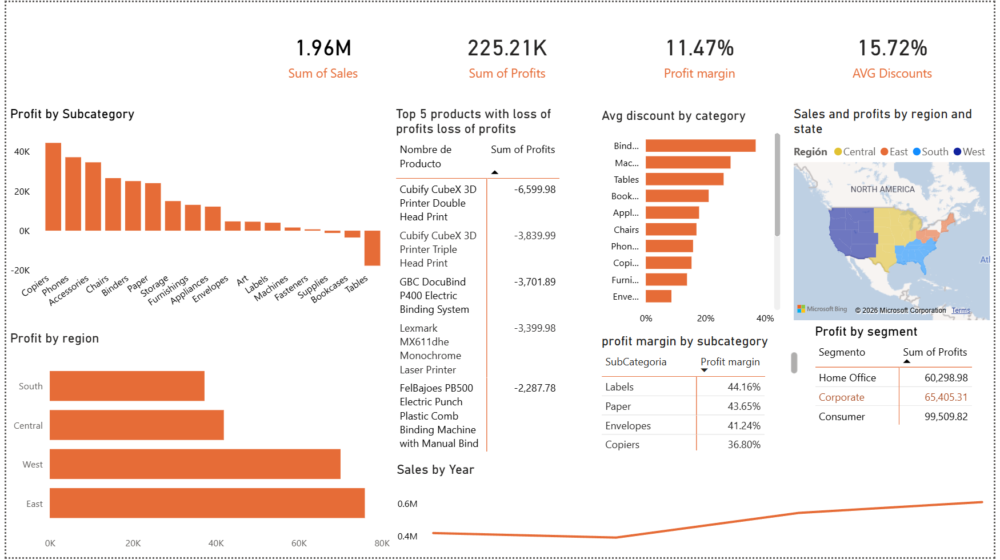

# SUPERSTORE---PROFITABILITY---DATA-ANALYST
Profitability analyst using excel, python, Mysql, and Power bi 

(DISCLAIMER: some parts in the data analysis can be in spanish, i'm trying to change it but it gonna take me some time) 
Superstore Profitability Analysis
1. Business Problem

this is a dataset by A2 capacitacion, the company and the data are inspired by a real company.
The company shows strong sales performance, but profitability is inconsistent across subcategories, regions, and customer segments.
Some products generate losses despite high revenue.

The objective of this analysis is to identify the key drivers of profitability issues and provide actionable business insights.

2. Dataset

Source: Superstore.xlsx dataset (original) / Data Superstore  proyect_01 (modified and analyzed)

Key variables:
Sales
Profit
Discount
Region
Category / Sub-Category
Customer Segment
Product Name

3. Methodology

REVIEW AND CLEANING DATA (EXCEL)
Standardized column names
Ensed consistency in categorical variables
Verified data types and structure

EXPLORATORY DATA ANALYSIS (Python)
Dataset inspection (structure, types, distributions)
Aggregations by subcategory, region, and segment
Analysis of relationships between:
Profit and Discount
Sales and Profit
Identification of loss-generating areas

DATA VISUALIZATION (Power BI)
Development of an interactive dashboard
Key metrics and breakdowns by:
Subcategory
Region
Segment
Product

4. Key Insights

Certain subcategories, particularly Tables and Bookcases, consistently generate losses
Higher discount levels are associated with lower profitability
The South region underperforms compared to other regions
The Home Office segment contributes less to overall performance
A small group of products drives a significant portion of total losses

5. Business Recommendations

Reduce or optimize discount strategies in loss-making subcategories
Reevaluate pricing for products with persistent negative profit
Investigate regional performance issues in the South
Prioritize high-performing customer segments
Monitor product-level profitability before applying discounts

6. Dashboard Preview

7. Tech Stack

Excel — Data cleaning
Python (Pandas, NumPy, Matplotlib, Seaborn) — Exploratory analysis
Power BI — Data visualization and dashboard development